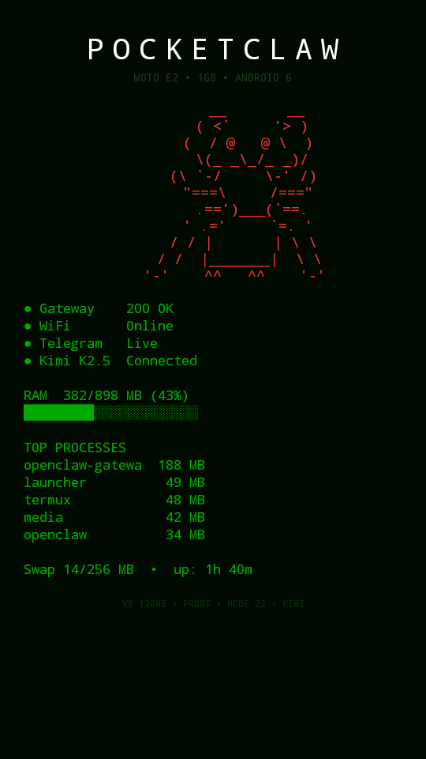
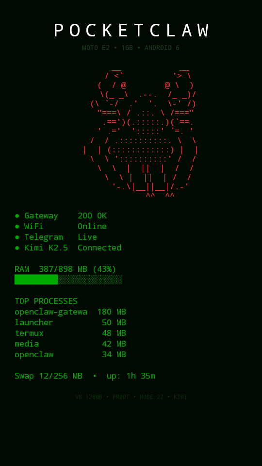
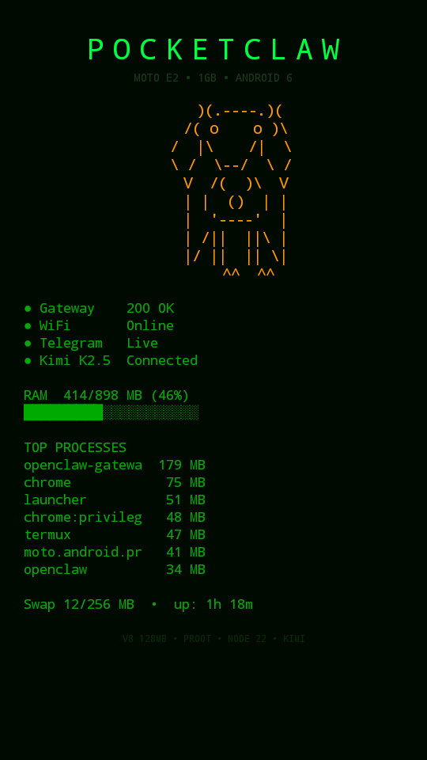

<div align="center">

```
 ██████╗  ██████╗  ██████╗██╗  ██╗███████╗████████╗ ██████╗██╗      █████╗ ██╗    ██╗
 ██╔══██╗██╔═══██╗██╔════╝██║ ██╔╝██╔════╝╚══██╔══╝██╔════╝██║     ██╔══██╗██║    ██║
 ██████╔╝██║   ██║██║     █████╔╝ █████╗     ██║   ██║     ██║     ███████║██║ █╗ ██║
 ██╔═══╝ ██║   ██║██║     ██╔═██╗ ██╔══╝     ██║   ██║     ██║     ██╔══██║██║███╗██║
 ██║     ╚██████╔╝╚██████╗██║  ██╗███████╗   ██║   ╚██████╗███████╗██║  ██║╚███╔███╔╝
 ╚═╝      ╚═════╝  ╚═════╝╚═╝  ╚═╝╚══════╝   ╚═╝    ╚═════╝╚══════╝╚═╝  ╚═╝ ╚══╝╚══╝
```

**A modern AI agent running on a $0 phone from 2015.**<br>
**1GB RAM. Android 6. Snapdragon 410. It works.**

[](https://opensource.org/licenses/MIT)
[](https://www.android.com)
[](https://openclaw.ai)
[](#-pick-your-ai)
[](https://core.telegram.org/bots)
[](CONTRIBUTING.md)

---

**They said it couldn't be done. 53 hacks later, it's running.**

[Setup Guide](#-setup-guide) · [The 53 Hacks](HACKS.md) · [Troubleshooting](#-troubleshooting) · [Contributing](CONTRIBUTING.md)

</div>

---

## The Dashboard

The web dashboard at `phone-ip:9000` has 4 pages: STATUS (live metrics + animated crab), LOGS (real-time gateway output with level filters), KEYS (API key management with search and categories), and CTRL (hardware controls, force GC, gateway restart). CRT green-on-black aesthetic with scanlines, vignette, scan beam, and glow pulse at 30fps. The native launcher app replaces the home screen.

<div align="center">


</div>

```
┌──────────────────────────────────────────┐
│         P O C K E T C L A W              │
│          MOTO E2 • 1GB • ANDROID 6       │
│                                          │
│              __       __                 │
│             / <`     `> \                │
│            (  / @   @ \  )               │
│             \(  \_-_/  )/                │
│           (\ `-/     \-` /)             │
│            "==/   _   \=="               │
│             .=') [_] (`=.                │
│            ' .='     `=. '               │
│                                          │
│  ● Gateway    200 OK    gateway  157 MB │
│  ● WiFi       Online    system    72 MB │
│  ● Telegram   Live      launcher  39 MB │
│  ● Kimi K2.5  Connected zygote    32 MB │
│                                          │
│  RAM  310/898 MB (34%)                   │
│  ███████░░░░░░░░░░░░░░                   │
│                                          │
│  Swap 14/256 MB  •  auto-boot ✓         │
│                                          │
│      V8 112MB • NATIVE • NODE 22 • KIMI  │
│  ┌──────┬──────┬──────┬──────┐           │
│  │  ⚙   │  ◔   │  ■   │  ◀  │           │
│  └──────┴──────┴──────┴──────┘           │
└──────────────────────────────────────────┘
```

---

## The Pitch

You have an old phone in a drawer. It's worthless. Nobody wants it.

We turned it into a **self-hosted AI assistant** that runs 24/7, answers on Telegram, and survives reboots on its own.

No cloud server. No root required. Bring your own AI — free or paid, your choice. Just a mass of hacks and stubbornness.

```
You:     "hey, what's the weather like?"
Bot:     "I'm running on a Moto E2 from 2015 with 1GB of RAM.
          I have no idea what the weather is, but I'm impressed
          I can even answer you right now."
```

## What You Get

- **A Telegram bot** running 24/7 on a phone that belongs in a museum
- **Any AI you want** — works with any OpenAI-compatible provider (see [Pick Your AI](#-pick-your-ai))
- **Voice messages** — send a voice note, get a text reply (via OpenAI Whisper)
- **Fully autonomous** — watchdog + health checks auto-restart on crash or freeze, survives reboots
- **`pocketclaw` CLI** — `start`, `stop`, `restart`, `status`, `logs`, `monitor` from one command
- **RAM-optimized** — 155 MB PSS with V8 heap 128 MB, native node22, 37 lazy proxies, GC every 30s — on hardware that has 1 GB total
- **Dalvik-free** — gateway detached via setsid, Termux Dalviks auto-killed after boot. Zero Java VMs running.
- **53 documented hacks** — every impossible problem we hit, and how we solved it
- **4-page dashboard** — STATUS (CRT crab + live metrics) / LOGS (real-time logs with filters) / KEYS (API key management) / CTRL (hardware controls, GC, restart). All accessible from any browser or the native launcher.
- **Aggressive debloat** — 144 → 13 packages, SystemUI killed, Android system under 70 MB

## The Hardware

This was stress-tested on the **absolute worst-case scenario**:

| | Spec | Required | Actual | Gap |
|---|---|---|---|---|
| **RAM** | 3 GB | 1 GB | **3x under** |
| **Android** | 10+ | 6.0 | **4 versions behind** |
| **CPU** | ARM64 | ARM32 | **Wrong architecture** |
| **Node.js** | v22 | v12 max (native) | **10 major versions** |

If it runs on a Moto E2 from 2015, **it runs on anything you own.**

> Got a phone from 2018+? You'll have a *much* easier time. The guide still applies, just with fewer hacks needed.

## Architecture

```
┌─────────────┐         ┌─────────────────┐
│  Telegram    │◄───────►│  Any LLM API    │
│  (you)       │         │  (your choice)  │
└──────┬───────┘         └────────┬────────┘
       │                          │
       └──────────┬───────────────┘
                  │
        ┌─────────▼──────────┐
        │  OpenClaw Gateway  │  155 MB PSS
        │  (port 9000)       │  (single process)
        ├────────────────────┤
        │  node22 (no ICU)   │  NDK cross-compiled
        │  + LD_PRELOAD shim │  API 23 compat
        ├────────────────────┤
        │  Termux (native)   │  sshd + cron only
        ├────────────────────┤
        │  Android 6         │  ~70 MB PSS
        │  (131 packages     │
        │   debloated)       │
        ├────────────────────┤
        │  PocketClaw APK    │  38 MB PSS
        │  (native launcher) │
        └────────────────────┘

        Total: ~310 MB / 898 MB
        Free:  ~588 MB
        Swap:  ~14 MB
```

All connections are **outbound**. The phone calls Telegram and your AI provider — they never call back. This means: any WiFi works, any hotspot works, no port forwarding, no dynamic DNS. Plug it in and forget about it.

---

## Current Status (February 2026)

**364 MB used → targeting ~290 MB** on 898 MB total RAM.

Latest session achievements:
- **Dalvik-free operation:** Gateway launched with `setsid` (detached session), then Termux Dalvik VMs killed via cron. Zero Java VMs running. Saves 20-40 MB.
- **fs.promises patching:** Extended path rewriting to async fs operations. Fixes `EACCES` on `/root` paths that broke Telegram channel.
- **3-page dashboard:** STATUS (live metrics + crab) / KEYS (API key management) / LOGS (real-time gateway output). All at `phone-ip:9000`.
- **Lazy loading v3:** Proxy-based deferred require — 37 package prefixes lazy-loaded. Everything works, only what you use consumes RAM.
- **Boot autonomy:** Survives reboots, Dalvik kills, WiFi drops. Fully unattended.
- **V8 128 MB heap + no ICU:** Reduced from 180 MB. Semi-space halved. Initial old space 32 MB. GC every 30s.

| Metric | Value |
|---|---|
| Total RAM used | ~364 MB (targeting ~290 MB) |
| Gateway RSS | ~155 MB |
| V8 heap limit | 128 MB |
| Android system | ~70 MB |
| Dalvik VMs | 0 (killed post-boot) |
| Lazy modules | 37 proxies, loads on demand |
| Boot time | ~90s to fully operational |
| Swap | ~14 MB / 256 MB |

---

## 📊 Performance

Running a modern AI gateway on 1 GB RAM requires aggressive optimization. Here's what we measured and tuned:

### Evolution

Every version squeezed more out of the same hardware:

| | **v0** Initial | **v2** Debloat | **v4** SystemUI opt | **v6** Single process | **v7** Native node | **v8** Lazy + tuned | **v9** Ultra |
|---|---|---|---|---|---|---|---|
| **Packages** | 144 | 25 | 19 | 13 | 13 | 13 | **13** |
| **Runtime** | proot | proot | proot | proot | native node22-icu | native node22-icu | **native node22 (no ICU)** |
| **Gateway RSS** | ~231 MB | ~231 MB | ~234 MB | 186 MB | 157 MB | 155 MB | **~140 MB** |
| **V8 heap** | 192 MB | 192 MB | 192 MB | 160 MB | 112 MB | 112 MB | **128 MB** |
| **Android sys** | ~450 MB | ~314 MB | ~170 MB | ~70 MB | ~70 MB | ~70 MB | **~70 MB** |
| **Total RAM** | ~780 MB | ~630 MB | ~500 MB | ~393 MB | ~310 MB | ~321 MB | **~290-310 MB** |
| **Swap** | 87 MB | 8 MB | 2 MB | 1 MB | 14 MB | 14 MB | **~14 MB** |
| **Module loading** | - | 9 stubs | 9 stubs | 9 stubs | 12 stubs | 37 lazy proxies | **37 lazy proxies** |
| **Dalvik VMs** | running | running | running | running | running | running | **0 (killed)** |
| **Boot** | manual | manual | manual | full auto | full auto | full auto | **full auto + setsid** |

**Total gains v0 → v9:** Android 450→70 MB (-84%), Gateway 231→~140 MB (-39%), proot eliminated, Dalviks killed, 131 packages removed, SystemUI eliminated, ICU removed, V8 heap 192→128 MB, GC 60→30s, lazy loading via Proxy, setsid detach.

### Memory budget (current — v8)

| Component | PSS | Notes |
|---|---|---|
| OpenClaw gateway | ~140 MB | Native node22 (no ICU), V8 heap 128 MB, lazy loading, LD_PRELOAD API23 shim |
| Android system (system_server) | 72 MB | 13 packages, SystemUI dead, dormants killed every 5 min |
| PocketClaw Launcher | 39 MB | Native HOME screen (no WebView), required by Android |
| zygote | 32 MB | Shared fork parent (unavoidable) |
| surfaceflinger | 10 MB | Display compositor |
| mediaserver | 7 MB | Respawns (init restarts it) |
| rild + netd + wpa | 7 MB | Radio, network, WiFi daemons |
| logd + other native | 9 MB | Logging, debuggerd, vold, keystore, etc. |
| Termux Dalviks | 0 MB | Killed post-boot via setsid + kill-dalvik cron |
| **Total PSS** | **~290-310 MB** | On 898 MB total — **~590-610 MB free**, 14 MB swap |

### What we tuned

| Optimization | Impact |
|---|---|
| **Native node22 (no ICU)** | NDK cross-compiled Node.js 22.12.0 without ICU data (~25 MB saved). No proot overhead → **-29 MB PSS** |
| **LD_PRELOAD API23 shim** | `libapi23compat.so` provides 11 API 24 symbols missing from Android 6.0's bionic |
| `--max-old-space-size=128` | Caps V8 heap. Reduced from 180 MB. GC works harder but RSS drops. |
| `--max-semi-space-size=1` | Reduces V8 young generation — more minor GC but less peak RSS |
| `--initial-old-space-size=32` | V8 starts small and grows on demand instead of pre-allocating |
| `--expose-gc` + periodic GC | Explicit `global.gc()` every 30s frees ~10 MB per cycle |
| **setsid + kill-dalvik** | Gateway detached, Termux Dalviks killed post-boot → **-20 to -40 MB** |
| Lazy loading v3 (Proxy) | 37 package prefixes deferred via Proxy — loads on first use. Saves ~40 MB RSS. |
| Debloat 126+64 packages | `pm uninstall -k --user 0` (126) + `pm disable` via Dirty COW (64) |
| Kill SystemUI | `pm uninstall -k --user 0 com.android.systemui` — launcher has nav buttons |
| Dirty COW daemon stopper | Kills drmserver, qcamerasvr, audiod, ppd. Kernel tuning via COW'd post_boot.sh |
| Dormant killer loop | Boot script force-stops respawning services every 5 min |
| Animations off | `window_animation_scale=0`, `transition_animation_scale=0`, `animator_duration_scale=0` |
| Low power mode | `settings put global low_power 1` — reduces SystemUI overhead |
| Screen brightness 0 | `screen_brightness=0`, `screen_off_timeout=15000` |

### What we tested and ruled out

| Idea | Result |
|---|---|
| V8 heap 96 MB | OOM — live heap peaks at 93 MB during startup module loading |
| V8 heap 128 MB (proot era) | OOM — working set ~124 MB with proot overhead |
| `--jitless` | Crashes — disables WebAssembly, OpenClaw has 5 WASM deps. On ARM32, only saves 3-5 MB anyway (no code range reservation on 32-bit) |
| `--lite-mode` | Same crash — also disables WASM |
| `--no-turbofan` | Exit code 9 — likely LMK kill during slower interpreter-only startup |
| `--single-threaded` | Crashes gateway immediately at startup (silent exit, no error). Works for simple scripts but not OpenClaw |
| `NODE_COMPILE_CACHE` | Creates versioned dir but 0 cache files on ARM32/Node 22. Research confirms: no heap reduction anyway — same bytecode objects regardless |
| esbuild bundling | Would **increase** memory 3-4x. V8 eagerly parses single large files (loses lazy parsing). Module system overhead is only ~2 MB for 1547 modules |
| Alternative runtimes (QuickJS, txiki.js, LLRT, Hermes) | None can run OpenClaw's 1547 npm modules. QuickJS uses 5-15 MB but lacks Node.js APIs. Would need complete rewrite |
| Kill PocketClaw Launcher | Android respawns immediately — HOME activity required |
| Kill Termux Dalvik (old) | Only saves ~3 MB without setsid — shared pages stay mapped. With setsid (Hack #49), saves 20-40 MB because gateway survives independently. |
| Dirty COW from Termux | SELinux blocks untrusted_app from opening /system files |
| `am hang` from Termux | Aborted — needs shell domain, not untrusted_app |
| Kill SystemUI via `am force-stop` | Doesn't work — PERSISTENT flag, needs `pm uninstall` |
| `pm disable-user` SystemUI | SecurityException — permission denied |
| `pm install -r /system/priv-app/X.apk` | Installs to `/data/app/`, **loses privileged permissions** — never do this |
| `pm clear com.android.systemui` | Corrupts keyguard → black screen lockout |
| `immersive.full=*` | Hides nav bar in ALL apps — user gets stuck in Settings |
| Force-stop `com.termux.boot` | Sets "stopped" flag → no `BOOT_COMPLETED` → bot won't auto-start |
| V8 startup snapshot (`--build-snapshot`) | ESM restore fails: `ERR_VM_DYNAMIC_IMPORT_CALLBACK_MISSING` |
| Module stubbing v3 (disk stubs) | Only -4 MB for high risk of breaking features — abandoned |
| Bun runtime | No ARM32 build available |

### Monitoring

The `monitor` script logs RAM, CPU, swap, disk, battery every 5 minutes to a CSV. The `logrotate` cron trims everything to 24h. The `healthcheck` cron restarts the gateway if it stops responding.

```
$ pocketclaw status
=== PocketClaw Status ===
Gateway:  RUNNING (PID 20122)
Uptime:   up 5 days, 17:00
RAM:      588MB available / 898MB total
Gateway:  159MB RSS (heap 112MB)
Swap:     14MB used
Disk:     2048MB free
Battery:  87%, 31.2°C
Crons:    2 active
```

---

## 🚀 Setup Guide

### Prerequisites

- An Android 5+ phone (any brand, any condition)
- WiFi connection
- 10 minutes of patience (30 min on 1GB RAM devices)

### Step 1 — Install Termux

| Android Version | What to Install |
|---|---|
| 5-6 | Termux **v0.119.0-beta.3** `apt-android-5` from [GitHub Releases](https://github.com/termux/termux-app/releases) |
| 7+ | Latest Termux from [F-Droid](https://f-droid.org/packages/com.termux/) |

> **Do NOT install from Google Play** — the Play Store version is deprecated.

### Step 2 — Base packages

```bash
pkg update -y
pkg install -y proot-distro openssh
```

### Step 3 — Install Node.js

**Option A — Android 7+ (easy):**
```bash
proot-distro install ubuntu
proot-distro login ubuntu
apt update && apt install -y curl ca-certificates
curl -fsSL https://deb.nodesource.com/setup_22.x | bash -
apt install -y nodejs
node -v   # v22.x
exit
```

**Option B — Android 5-6 / native (advanced):**

Proot is too slow on 1GB devices. Cross-compile Node.js with NDK instead:
```bash
# On a Linux build machine (see tools/build-node-icu.sh)
# Produces: node22-icu binary + libapi23compat.so
# Deploy to: $PREFIX/bin/node22-icu, $PREFIX/lib/libapi23compat.so
```

### Step 4 — Install OpenClaw

```bash
# Option A (proot):
proot-distro login ubuntu
npm install -g openclaw
exit

# Option B (native): use node22-icu to run npm
node22-icu $(which npm) install -g openclaw
```

### Step 5 — Deploy PocketClaw files

Clone this repo on your PC and push files to the phone:

```bash
# On your PC
git clone https://github.com/MonteiroRobin/pocketclaw.git
cd pocketclaw

# Push scripts to the phone
adb push scripts/hijack.js /sdcard/Download/
adb push scripts/start-openclaw.sh /sdcard/Download/
adb push scripts/restart-gw.sh /sdcard/Download/
adb push scripts/boot-openclaw.sh /sdcard/Download/
adb push config/openclaw.example.json /sdcard/Download/
adb push config/env.example /sdcard/Download/
```

Then in Termux:
```bash
PREFIX=/data/data/com.termux/files/usr
ROOTFS=$PREFIX/var/lib/proot-distro/installed-rootfs/ubuntu

# Install scripts
cp /sdcard/Download/start-openclaw.sh $PREFIX/bin/start-openclaw
cp /sdcard/Download/restart-gw.sh $PREFIX/bin/restart-gw
chmod +x $PREFIX/bin/start-openclaw $PREFIX/bin/restart-gw

# Install hijack.js and config
cp /sdcard/Download/hijack.js $ROOTFS/root/hijack.js
mkdir -p $ROOTFS/root/.openclaw
cp /sdcard/Download/openclaw.example.json $ROOTFS/root/.openclaw/openclaw.json
```

### Step 6 — Get your API keys

**AI Provider API Key:** Pick any provider from the [Pick Your AI](#-pick-your-ai) section below. Get an API key from their dashboard.

**Telegram Bot Token:**
1. Message [@BotFather](https://t.me/BotFather) on Telegram
2. `/newbot` → follow prompts → copy the token

### Step 7 — Configure API keys

**Option A — Interactive setup (easiest):**
```bash
# On your PC — asks for each key, pushes to phone, restarts gateway
./tools/setup-keys.sh
```

**Option B — From a pre-filled file:**
```bash
# Copy and fill in your keys
cp config/env.example my-keys.env
# Edit my-keys.env with real values, then:
./tools/setup-keys.sh my-keys.env
```

**Option C — Manual (via Termux SSH):**
```bash
cat > $ROOTFS/root/.openclaw/env << EOF
KIMI_API_KEY=sk-kimi-YOUR_ACTUAL_KEY
MOONSHOT_API_KEY=sk-kimi-YOUR_ACTUAL_KEY
TELEGRAM_BOT_TOKEN=1234567890:YOUR_ACTUAL_TOKEN
OPENAI_API_KEY=sk-proj-YOUR_ACTUAL_KEY
EOF
chmod 600 $ROOTFS/root/.openclaw/env
```

> **OPENAI_API_KEY is optional** — only needed for voice message transcription (Whisper). The bot works fine without it, you just won't be able to send voice notes.

### Step 8 — Launch

```bash
restart-gw
```

Wait 30-60 seconds. Then open Telegram and message your bot.

**If it replies, you're done.**

### Step 9 — Auto-start on boot (optional)

Install [Termux:Boot](https://github.com/termux/termux-boot/releases) and set up auto-start:

```bash
# Install via ADB from PC
curl -L -o termux-boot.apk "https://github.com/termux/termux-boot/releases/download/v0.8.1/termux-boot-app_v0.8.1+github.debug.apk"
adb install termux-boot.apk
# Open the app ONCE on the phone to activate it
```

```bash
# In Termux: install boot script
mkdir -p ~/.termux/boot
cp /sdcard/Download/boot-openclaw.sh ~/.termux/boot/start-pocketclaw.sh
chmod +x ~/.termux/boot/start-pocketclaw.sh
```

Now unplug the phone. Put it in a drawer. It restarts everything on its own after a reboot.

### Step 10 — Debloat (recommended for 1GB devices)

Run the debloat script to free ~360 MB of RAM:

```bash
# On your PC, via ADB
./restore-debloat.sh
adb reboot
```

This removes 131 packages (Google, Motorola bloat, telephony, SystemUI, media providers) and applies server-mode tuning. See `debloat-snapshot-v7.txt` for the full state.

> **WARNING:** Never `am force-stop com.termux.boot` — it prevents auto-start on reboot.

### Step 11 — Harden for 24/7 (recommended)

The phone will sleep with the screen off. These settings keep WiFi and Termux alive in the background:

```bash
# On your PC, via ADB — run once
adb shell settings put global wifi_sleep_policy 2          # WiFi never sleeps
adb shell dumpsys deviceidle whitelist +com.termux         # Exempt Termux from Doze
adb shell dumpsys deviceidle disable                       # Disable Doze entirely
```

> **Don't disable screen sleep.** The phone should go to sleep normally — WiFi stays on, Termux runs in the background, and the watchdog restarts the gateway if it ever crashes.

The `start-openclaw` script includes a **watchdog loop**: if the gateway dies (network error, OOM, etc.), it waits 10 seconds, cleans lock files, and restarts automatically. No manual intervention needed.

---

## 🧠 Pick Your AI

OpenClaw works with **30+ providers** out of the box. Just change the provider, model name, and API key in `openclaw.json`. Model format is always `provider/model-name`.

### Free tier providers (no credit card needed)

| Provider | ID | Free Tier | Best Models | Context |
|---|---|---|---|---|
| **[Google Gemini](https://ai.google.dev/)** | `google` | 1,000 req/day, 250K TPM | Gemini 2.5 Pro/Flash | **1M** |
| **[Groq](https://console.groq.com/)** | `groq` | 500K tokens/day | Llama 4, Qwen3 | 131K |
| **[Cerebras](https://cloud.cerebras.ai/)** | `cerebras` | ~1M tokens/day | Llama 3.3 70B, GLM 4.7 | 128K |
| **[SambaNova](https://cloud.sambanova.ai/)** | custom | 10-30 RPM | Llama 405B | 128K |
| **[OpenRouter](https://openrouter.ai/)** | `openrouter` | Free `:free` models | DeepSeek, Gemini, Llama | Varies |
| **[Mistral](https://console.mistral.ai/)** | `mistral` | 1B tokens/month (2 RPM) | Mistral Small, Pixtral | 128K |
| **[Venice AI](https://venice.ai/)** | `venice` | Free tier available | Llama 3.3 70B | 128K |

### Paid providers

| Provider | ID | Pricing | Best Models | Context |
|---|---|---|---|---|
| **[Anthropic](https://console.anthropic.com/)** | `anthropic` | Pay-per-token | Claude Opus 4.6, Sonnet 4.5 | 200K |
| **[OpenAI](https://platform.openai.com/)** | `openai` | Pay-per-token | GPT-5.2, GPT-5 Mini | 128K |
| **[Kimi Coding](https://kimi.com/code)** | custom | ~$19/month | Kimi K2.5 | 262K |
| **[xAI (Grok)](https://x.ai/api)** | `xai` | $25 free credit then paid | Grok 4, Grok 4 Mini | 131K |
| **[DeepSeek](https://platform.deepseek.com/)** | custom | $0.03-$0.42/M tokens | DeepSeek V3.2, R1 | 128K |
| **[Amazon Bedrock](https://aws.amazon.com/bedrock/)** | `amazon-bedrock` | AWS pricing | Claude, Llama, etc. | Varies |
| **[Google Vertex AI](https://cloud.google.com/vertex-ai)** | `google-vertex` | GCP pricing | Gemini models | 1M |
| **[Z.AI (Zhipu)](https://open.bigmodel.cn/)** | `zai` | Pay-per-token | GLM-4.7, GLM-4.6v | 128K |
| **[MiniMax](https://www.minimax.io/)** | custom | Pay-per-token | MiniMax M2.1 | 128K |

### Local models (free, runs on your network)

| Provider | ID | Setup |
|---|---|---|
| **[Ollama](https://ollama.com/)** | `ollama` | Auto-discovered at `localhost:11434` |
| **[LM Studio](https://lmstudio.ai/)** | custom | `http://localhost:1234/v1` |
| **[vLLM](https://docs.vllm.ai/)** | custom | Any OpenAI-compatible `/v1` endpoint |

> **This guide uses Kimi K2.5** because that's what we stress-tested PocketClaw with. But if you want $0/month, grab a free provider above — **Gemini and Groq** are the easiest to set up. For full privacy, run a local model with Ollama.

---

## ⚙️ Configuration

### Critical settings in `openclaw.json`

| Setting | Why it matters |
|---|---|
| `User-Agent: claude-code/1.0` | **Kimi only.** Kimi API blocks requests without a recognized coding agent header. Not needed for other providers. |
| `plugins.entries.telegram.enabled: true` | **Required.** Without this, Telegram won't load even if `channels.telegram` is configured. |
| `reasoning: false` | Prevents extended thinking mode that can cause empty responses. |
| `network.autoSelectFamily: true` | Enables dual-stack IPv4/IPv6 for better connectivity. |
| `--max-old-space-size=128` | Caps V8 heap. Reduced from 180 MB. Stable with aggressive GC. |
| `--expose-gc` | Enables `global.gc()`. Combined with hijack.js timer, frees ~10 MB every 30s. |
| `maxConcurrency: 1` | One request at a time. More would OOM on 1 GB RAM. |

See [`config/openclaw.example.json`](config/openclaw.example.json) for the full working configuration.

---

## 🔧 Troubleshooting

<details>
<summary><b>Bot doesn't respond</b></summary>

1. Check processes: `ps | grep openclaw`
2. Check logs: `tail -20 $PREFIX/tmp/openclaw-gateway.log`
3. Test Telegram: `node22-icu -e "fetch('https://api.telegram.org/botTOKEN/getMe').then(r=>r.json()).then(console.log)"`
</details>

<details>
<summary><b>"fetch failed" errors</b></summary>

Network issue. Check WiFi. If IPv4 routing is broken, reboot the phone.
</details>

<details>
<summary><b>"403 Kimi For Coding is currently only available for Coding Agents"</b></summary>

The `User-Agent: claude-code/1.0` header is missing. Set it at **both** provider and model level in `openclaw.json`.
</details>

<details>
<summary><b>"Message ordering conflict"</b></summary>

Send `/new` to the bot. This resets the session after gateway restarts.
</details>

<details>
<summary><b>Gateway won't start / "already running"</b></summary>

Stale lock files. Use `restart-gw` (handles cleanup automatically) or manually:
```bash
rm -f $ROOTFS/tmp/openclaw/*.lock
```
</details>

<details>
<summary><b>Out of memory / phone freezes</b></summary>

- Verify `--max-old-space-size=112` is in NODE_OPTIONS
- Run `restore-debloat.sh` to remove bloat packages
- Kill dormant services: `am force-stop com.android.settings` etc.
- **Never kill** `com.termux` or `com.termux.boot`
</details>

<details>
<summary><b>Gateway OOM at startup</b></summary>

The live heap peaks at 93 MB during module loading. V8 heap 96 MB OOMs. Use 112 MB minimum (native) or 128 MB (proot).
</details>

<details>
<summary><b>Stuck in Settings (no back button)</b></summary>

If SystemUI is uninstalled, there's no system nav bar outside the launcher. Use:
```bash
adb shell input keyevent KEYCODE_BACK
adb shell input keyevent KEYCODE_HOME
```
</details>

<details>
<summary><b>Bot doesn't auto-start after reboot</b></summary>

Check if `com.termux.boot` was force-stopped. `am force-stop` sets the "stopped" flag which blocks `BOOT_COMPLETED` broadcasts. Fix:
```bash
# Open Termux:Boot app manually once, or:
adb shell monkey -p com.termux.boot -c android.intent.category.LAUNCHER 1
```
</details>

---

## 📸 Screenshots

<div align="center">

| Dashboard v2.3 | Crab Art v2 | Dashboard v2.2 |
|---|---|---|
|  |  |  |

</div>

---

## 📂 Project Structure

```
pocketclaw/
├── README.md                      # You are here
├── HACKS.md                       # The 53 hacks — the full war story
├── CONTRIBUTING.md                 # How to contribute
├── LICENSE                         # MIT
├── restore-debloat.sh             # One-script debloat (126 packages + tuning)
├── active-packages.txt            # Current 13 active packages
├── debloat-snapshot-v7.txt        # Full system state (native gateway)
├── ram-snapshot-v5.txt            # dumpsys meminfo snapshot
├── config/
│   ├── openclaw.example.json      # Working config (copy & fill in keys)
│   └── env.example                # API key template
├── scripts/
│   ├── start-openclaw.sh          # Native gateway launcher with watchdog loop
│   ├── restart-gw.sh              # Clean kill + restart (handles process.title)
│   ├── boot-openclaw.sh           # Termux:Boot auto-start + cron setup
│   ├── pocketclaw.sh              # CLI: start/stop/restart/status/logs/monitor
│   ├── healthcheck.sh             # Cron: restart gateway if unresponsive
│   ├── logrotate.sh               # Cron: trim logs and CSV to 24h
│   ├── wifi-watchdog.sh           # WiFi connectivity watchdog
│   └── hijack.js                  # Runtime patch: GC + 3-page dashboard + lazy loading v3 + fs path rewriting
├── tools/
│   ├── api23_compat.c             # LD_PRELOAD shim: 11 API 24 symbols for Android 6
│   ├── build-node-icu.sh          # NDK cross-compile Node.js 22 with ICU for ARM
│   ├── windows/
│   │   ├── pocketclaw-boot.ps1    # Windows auto daemon-stopper on USB connect
│   │   └── Register-PocketClawBoot.ps1  # Register as Windows Scheduled Task
│   ├── start-pocketclaw.sh        # Boot script (WiFi wait, setsid gateway, merged kill loop)
│   ├── kill-dalvik.sh             # Cron: kill Termux Dalviks after gateway detach
│   ├── fix-stubs.sh               # Fix ESM stubs for bind-mount setup
│   ├── fix-and-install.sh         # Full install automation
│   ├── set-static-ip.sh           # Static IP configuration
│   ├── crash-dismisser.sh         # Auto-dismiss crash dialogs
│   ├── kernel-tune.c              # Kernel parameter tuner (sysctl)
│   └── check-git.sh              # Git wrapper verification
├── apk/
│   ├── AndroidManifest.xml        # Launcher APK manifest (HOME intent)
│   └── src/.../LauncherActivity.java  # Native dashboard — no WebView
└── *.png                          # Screenshots
```

### On the phone

```
$PREFIX/bin/
  ├── node22               # NDK cross-compiled Node.js 22.12.0 (no ICU)
  ├── node22-icu           # Node.js with ICU (fallback if Intl needed)
  ├── start-openclaw       # Native gateway + watchdog loop
  ├── restart-gw           # Clean kill + restart
  ├── pocketclaw           # CLI
  ├── healthcheck          # Cron every 2 min
  ├── kill-dalvik          # Cron every 2 min — kill Termux Dalviks
  └── logrotate-pc         # Cron every hour

$PREFIX/lib/
  └── libapi23compat.so    # LD_PRELOAD shim (11 API 24 symbols)

~/.termux/boot/
  └── start-pocketclaw.sh  # Auto-start: WiFi wait → gateway → killer loops

$ROOTFS/root/
  ├── hijack.js            # GC + 3-page dashboard + lazy loading v3 + fs path rewriting
  └── .openclaw/
      ├── openclaw.json    # Config with real keys
      └── env              # API keys
```

---

## The 53 Hacks

Every single problem we hit — and the hack that fixed it. From proot crashes to Dirty COW kernel exploits, from cross-compiling Node.js with NDK to shimming 11 missing API 24 symbols via LD_PRELOAD. From OOM at 96 MB heap to killing Dalvik VMs post-boot for Dalvik-free operation.

**[Read the full story →](HACKS.md)**

---

## Tested With

| Component | Version |
|---|---|
| Phone | Moto E2 4G LTE (XT1524), 2015 |
| Android | 6.0 Marshmallow |
| RAM | 1 GB (898 MB usable) |
| Termux | v0.119.0-beta.3 (apt-android-5) |
| Node.js | 22.12.0 (NDK cross-compiled with ICU, native — no proot) |
| OpenClaw | 2026.2.9 |
| AI Model | Kimi K2.5 (works with [any provider](#-pick-your-ai)) |
| Debloat | v9 — 13 packages, native node22 (no ICU), lazy proxies, setsid + kill-dalvik, ~290-310 MB total |

---

## Contributing

Got it running on a different phone? Found a better hack? Want to add support for another AI provider?

**[See CONTRIBUTING.md →](CONTRIBUTING.md)**

---

## License

MIT — do whatever you want with it.

---

<div align="center">

**Built with stubbornness on a mass of impossible constraints.**

*A phone from 2015. 1GB of RAM. 190 packages debloated. Native Node.js. Dalvik-free. 53 hacks.*<br>
*If it can run AI, anything can.*

**[Star this repo](https://github.com/MonteiroRobin/pocketclaw)** if you think old phones deserve a second life.

</div>

---

*PocketClaw v4.0 — Native Gateway*
